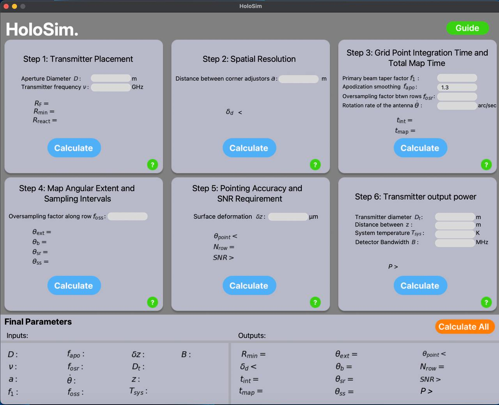

# HoloSim: Submillimeter-Wave Holography for Large Dish Antennas

HoloSim is an open-source Python-based tool designed for the systematic development and simulation of near-field holography systems for large dish antennas. This tool helps streamline the design of submillimeter-wave holography setups by providing a theoretical framework and design parameter recommendations for evaluating system performance before physical implementation.


**HoloSim’s User Interface**

## Features

### Six-Step Design Process
HoloSim divides the holography system setup into six main steps, each corresponding to a crucial design parameter:
- Transmitter Placement
- Spatial Resolution
- Grid Point Integration Time and Total Map Time
- Angular Extent and Sampling Intervals
- Pointing Accuracy and SNR Requirements
- Transmitter Output Power

## Installation

### Option 1: Run from Source

1. **Clone the Repository**
   ```bash
   git clone https://github.com/yourusername/HoloSim.git
   ```

2. **Install Dependencies**  
   HoloSim requires Python 3.11.7 and the following packages:
   ```bash
   pip install -r requirements.txt
   ```
   Dependencies include:
   - numpy: for numerical computations
   - matplotlib: for plotting and graphing
   - scipy: for integration and other scientific computations
   - Pillow (PIL): for handling image files
   - pymupdf (fitz): for PDF handling and processing
   - tkinter: (typically included with Python) for the GUI

3. **Run the Application**
   ```bash
   python main.py 
   ```
   Or loacate main.py in your operating systems folder (Both folders are labled) hit the 'run' button in main.py in your IDE for the selected operating system. 

### Option 2: Use the Executable 

For convenience, an executable file is provided for macOS, Linux, and Windows users.

1. **Download the Latest Release**  
   Visit the releases section of this repository and download the executable file suitable for your operating system.

2. **Run the Executable**  
   - **macOS:**
     1. Locate the downloaded `.dmg` file in your file explorer.
     2. Double-click the `.dmg` file to open it.
     3. In the window that appears, drag the app icon to the **Applications** folder.
     4. Once copied, close the window and eject the `.dmg` by right-clicking it and selecting **Eject**.
     5. Open the application from **Launchpad** or **Finder > Applications**.

     > **Note:** If macOS prevents the app from opening due to security settings, go to **System Settings > Privacy & Security**, scroll to **Security**, and click **Open Anyway** for the app.

   - **Windows:**
     1. Locate the downloaded `.exe` file in your file explorer.
     2. Double-click the executable to run it.
     > **Note:** If a security warning appears, click "More info" and then "Run anyway" to proceed.

## Future Plans

Future updates will extend HoloSim to support direct measurement and post-processing of near-field holography data, addressing additional errors inherent in near-field measurements. The goal is to establish a more standardized, adaptable approach for holographic antenna measurement across different applications. If any questions persist, please feel free to reach us at mxa220164@utdallas.edu or dario.tringali@colorado.edu